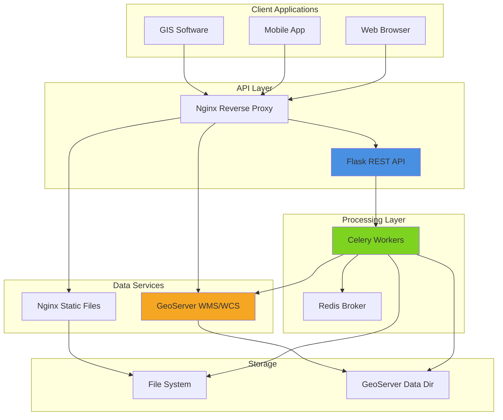
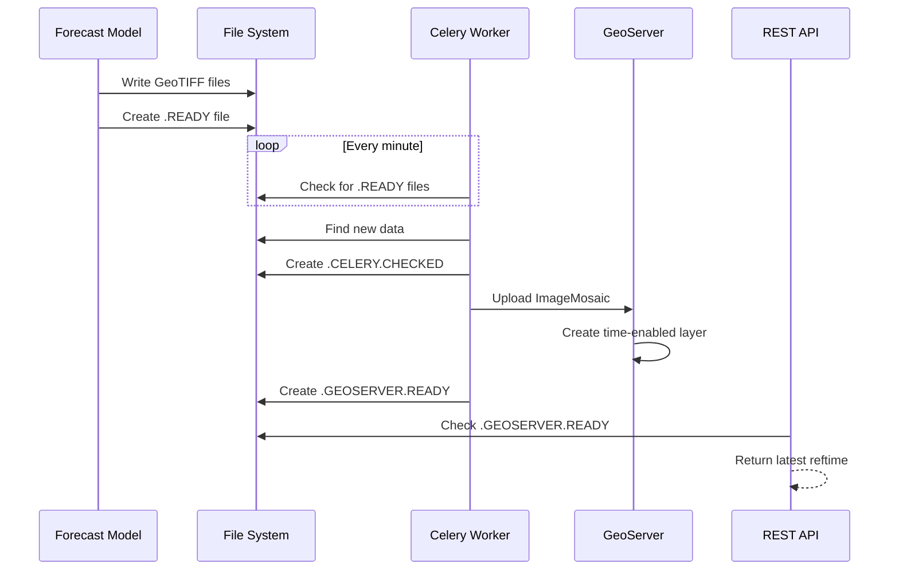
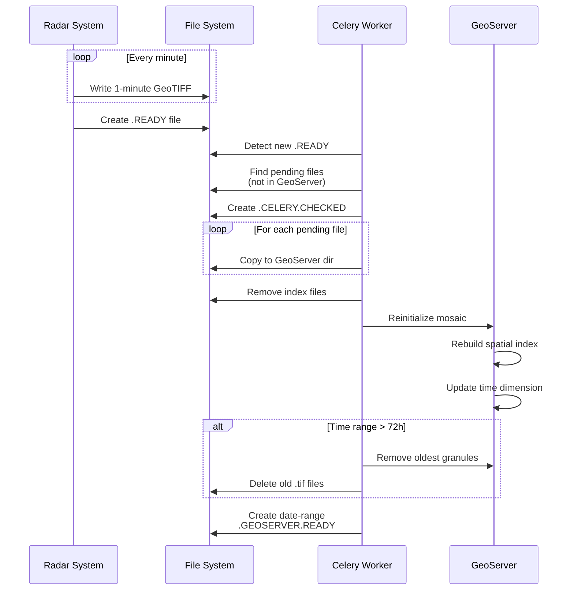
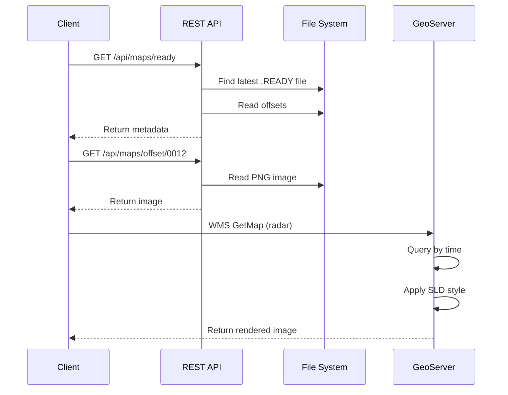

# Service Architecture Documentation

This document provides an overview of the Meteo-Hub-Maps service architecture, components, and data flow.

## System Overview

The Meteo-Hub-Maps service is a comprehensive meteorological data serving platform that provides:
- REST API for forecast metadata and map images
- GeoServer WMS/WCS for dynamic raster data
- Static tile serving for pre-rendered maps
- Automated data ingestion and monitoring

## Technology Stack

### Backend Services

- **Python 3.x** - Core application language
- **Flask** - Web framework for REST API
- **RAPyDo** - Development and deployment framework
- **Celery** - Distributed task queue for background jobs
- **Redis** - Message broker for Celery
- **PostgreSQL** - Relational database (if needed)

### Geospatial Services

- **GeoServer 2.26.x** - WMS/WCS map server
- **GDAL** - Geospatial data abstraction library
- **ImageMosaic Plugin** - Time-enabled raster management

### Infrastructure

- **Docker** - Container orchestration
- **Nginx** - Static file serving and reverse proxy
- **Rapydo CLI** - Service management

## Component Architecture



## Data Flow

### 1. Forecast Data Ingestion (Windy)



### 2. Radar Data Ingestion (Batch)



### 3. Map Request Flow



## Directory Structure

```
/home/dcrisant/Documents/MISTRAL/meteo-hub-maps/
├── projects/
│   └── maps/
│       ├── backend/
│       │   ├── endpoints/      # REST API endpoints
│       │   │   ├── maps.py
│       │   │   ├── windy.py
│       │   │   ├── seasonal.py
│       │   │   ├── sub_seasonal.py
│       │   │   ├── tiles.py
│       │   │   ├── dataready.py
│       │   │   └── config.py
│       │   ├── tasks/          # Celery tasks
│       │   │   ├── check_fs_data.py
│       │   │   ├── radar.py
│       │   │   ├── data_ready.py
│       │   │   ├── upload_image_mosaic.py
│       │   │   └── geoserver_utils.py
│       │   └── utils/
│       ├── builds/
│       │   └── geoserver/
│       │       └── SLDs/       # Style files
│       └── confs/              # Configuration
├── data/                       # Data mount point
│   ├── G100/
│   │   └── PROD/
│   │       ├── Windy-00-ICON_2I_all2km.web/
│   │       ├── Windy-12-ICON_2I_all2km.web/
│   │       ├── Tiles-00-lm2.2.web/
│   │       └── Magics-00-lm2.2.web/
│   └── leonardo/
├── geoserver_data/             # GeoServer data
│   └── copies/
│       ├── radar-sri/
│       ├── radar-srt/
│       └── windy-icon-00/
└── docs/                       # Documentation
    ├── API.md
    ├── WINDY_DATA.md
    ├── SEASONAL_DATA.md
    ├── RADAR_DATA.md
    ├── TILES_DATA.md
    ├── GEOSERVER.md
    └── ARCHITECTURE.md
```

## Key Components

### REST API Endpoints

Located in `projects/maps/backend/endpoints/`:

| Endpoint | File | Purpose |
|----------|------|---------|
| `/api/maps/*` | `maps.py` | Forecast map images and metadata |
| `/api/windy` | `windy.py` | Windy forecast data info |
| `/api/seasonal/latest` | `seasonal.py` | Seasonal forecast status |
| `/api/sub-seasonal/latest` | `sub_seasonal.py` | Sub-seasonal forecast status |
| `/api/tiles` | `tiles.py` | Tile map metadata |
| `/api/data/monitoring` | `dataready.py` | Start/stop monitoring tasks |

### Celery Tasks

Located in `projects/maps/backend/tasks/`:

| Task | File | Purpose |
|------|------|---------|
| `check_latest_data_and_trigger_geoserver_import_windy` | `check_fs_data.py` | Monitor windy data |
| `check_latest_data_and_trigger_geoserver_import_seasonal` | `check_fs_data.py` | Monitor seasonal data |
| `check_latest_data_and_trigger_geoserver_import_sub_seasonal` | `check_fs_data.py` | Monitor sub-seasonal data |
| `check_latest_data_and_trigger_geoserver_import_radar` | `check_fs_data.py` | Monitor radar data |
| `update_geoserver_radar_layers` | `radar.py` | Ingest radar batch |
| `update_geoserver_image_mosaic` | `upload_image_mosaic.py` | Ingest windy data |
| `update_geoserver_seasonal_layers` | `data_ready.py` | Ingest seasonal data |
| `update_geoserver_sub_seasonal_layers` | `sub_seasonal.py` | Ingest sub-seasonal data |

### GeoServer Utilities

Located in `projects/maps/backend/tasks/geoserver_utils.py`:

- `create_workspace_generic()` - Create workspace
- `upload_geotiff_generic()` - Upload ImageMosaic
- `publish_layer_generic()` - Publish coverage
- `associate_sld_with_layer_generic()` - Apply styles
- `update_slds_from_local_folders()` - Sync SLD files

## Deployment

### Development Mode

```bash
# Clone repository
git clone https://gitlab.hpc.cineca.it/mistral/meteo-hub-maps.git
cd meteo-hub-maps

# Install RAPyDo controller
sudo pip3 install --upgrade git+https://github.com/rapydo/do.git@2.4

# Initialize and start
rapydo install
rapydo init
rapydo pull
rapydo start

# Start API manually (dev mode)
rapydo shell backend --default
```

### Production Mode

```bash
# API service starts automatically
rapydo start

# Nginx proxies requests
# http://server:8080/api -> Flask backend
# http://server:8080/geoserver -> GeoServer
```

### Service Management

```bash
# Start all services
rapydo start

# Stop services
rapydo stop

# View logs
rapydo logs backend
rapydo logs geoserver

# Shell access
rapydo shell backend
rapydo shell geoserver
```

## Scaling Considerations

### Horizontal Scaling

- **API Service:** Scale Flask workers behind load balancer
- **Celery Workers:** Add worker instances for parallel processing
- **GeoServer:** Cluster with shared data directory

### Caching

- **API Responses:** Enable Flask-Caching with Redis
- **GeoServer:** Enable GeoWebCache for WMS tiles
- **Static Files:** CDN for tile serving

### Data Management

- **Archival:** Move old forecast runs to cold storage
- **Cleanup:** Automated deletion of expired data
- **Partitioning:** Separate data by platform/environment

## Monitoring and Observability

### Health Checks

- **API:** `GET /api/status` - Returns "Server is alive"
- **GeoServer:** `GET /geoserver/rest/about/status`
- **Celery:** Monitor task queue depth in Redis

### Logging

- **Flask:** Application logs in `backend` container
- **Celery:** Task logs with correlation IDs
- **GeoServer:** WMS request logs

### Metrics

Key metrics to monitor:
- API response times
- Celery task duration
- GeoServer WMS request latency
- Disk usage (data directories)
- Granule counts per mosaic

## Security

### Authentication

- IP-based restrictions on `/api/data/*` endpoints
- GeoServer admin credentials via environment variables
- No authentication on public data endpoints

### Network

- Internal Docker network for service communication
- Nginx reverse proxy for external access
- CORS headers for browser clients

## Developer Guide

### DataWatcher Utility

The `DataWatcher` class (`projects/maps/backend/tasks/data_watcher.py`) provides a standardized way to monitor file system directories for new data and trigger processing tasks. It abstracts common patterns found in data ingestion workflows, such as:

- Scanning directories for marker files (e.g., `.READY`).
- Identifying the latest available dataset.
- Preventing duplicate processing via debounce files (`.CELERY.CHECKED`).
- Checking if data has already been fully processed (`.GEOSERVER.READY`).
- Triggering Celery tasks or custom actions.

#### Usage

To use `DataWatcher`, instantiate it with the target paths and configuration, then call `check_and_trigger()`.

**Basic Example:**

```python
from maps.tasks.data_watcher import DataWatcher

def check_my_data():
    watcher = DataWatcher(
        paths=["/data/source1", "/data/source2"],
        ready_suffix=".READY",
        identifier_extractor=lambda f: f.split(".")[0]  # Extract ID from filename
    )
    
    watcher.check_and_trigger(
        task_name="my_processing_task",
        task_args=lambda identifier, filename, path: (identifier, path)
    )
```

**Advanced Configuration:**

- **`sort_key`**: Custom function to sort files (e.g., by timestamp in filename).
- **`debounce_seconds`**: Time to wait before re-processing a file if the debounce marker exists (default: 600s).
- **`custom_processed_check`**: Function to override the default `.GEOSERVER.READY` check.
- **`custom_action`**: Function to execute arbitrary code instead of triggering a Celery task directly.
- **`skip_debounce`**: Set to `True` to disable the creation of the default `.CELERY.CHECKED` file (useful for custom debounce logic).

#### Workflow

1.  **Scan**: Finds all files ending with `ready_suffix` in the specified `paths`.
2.  **Sort**: Sorts files to identify the "latest" one based on `sort_key`.
3.  **Check Processed**: Checks if a corresponding `processed_suffix` file exists (or runs `custom_processed_check`).
4.  **Debounce**: Checks if a `.CELERY.CHECKED` file exists and is recent. If so, skips processing.
5.  **Trigger**:
    - If `custom_action` is provided, executes it.
    - Otherwise, triggers the Celery task specified by `task_name` with `task_args`.

### DataWatcherStream Utility

The `DataWatcherStream` class (also in `projects/maps/backend/tasks/data_watcher.py`) is a specialized subclass of `DataWatcher` designed for stream-based data sources like radar. It handles scenarios where data arrives continuously and needs to be processed in batches or ranges, rather than as discrete, independent datasets.

#### Key Features

- **Range-Based Checking**: Instead of checking for a single `.GEOSERVER.READY` file, it checks for range-based markers (e.g., `start-end.GEOSERVER.READY`) to determine if a timestamp falls within an already processed range.
- **Range-Based Debouncing**: Uses range-based `.CELERY.CHECKED` files to prevent duplicate processing of time ranges.
- **Pending File Calculation**: Automatically identifies all pending files within a retention window (e.g., last 72 hours) that haven't been processed yet.
- **Batch Triggering**: Triggers tasks with a list of pending files and dates, rather than a single file.

#### Usage

```python
from maps.tasks.data_watcher import DataWatcherStream

watcher = DataWatcherStream(
    paths="/data/radar/sri",
    ready_suffix=".READY",
    processed_suffix=".GEOSERVER.READY",
    debounce_seconds=1800,
    retention_hours=72,
    time_format="%Y%m%d%H%M",
    file_time_format="%d-%m-%Y-%H-%M.tif"
)

watcher.check_and_trigger(
    task_name="update_geoserver_radar_layers",
    var_name="sri"
)
```

## Future Enhancements

Potential improvements:
- **Caching:** Implement Redis-based API caching
- **Async Processing:** Long-running tasks with WebSocket updates
- **Versioning:** API version management
- **Real-time Updates:** WebSocket notifications for new data
- **User Management:** Authentication for restricted datasets
